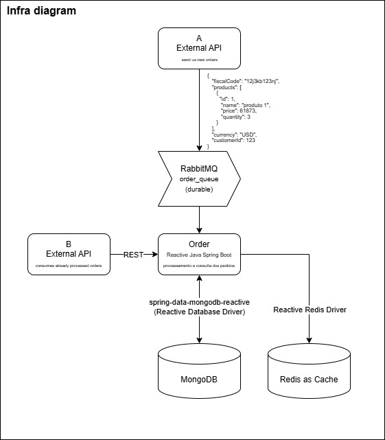

## REST API Swagger path: http://localhost:8080/swagger-ui

___

# Starting the application locally:

- run docker-compose up
- your application is now ready to be used

## Using the application:

- To send messages into RabbitMQ, access http://localhost:15672/
    - default credentials are guest/guest
- open queue orders_queue and start sending payloads
   - example payload:
     `{"fiscalCode":"12j3kb123nj","products":[{"id":1,"name":"produto 1","price":61873,"quantity":3},{"id":2,"name":"produto 2","price":12454,"quantity":1},{"id":3,"name":"produto 3","price":7162,"quantity":1}],"currency":"USD","customerId":123}`
- your order should now be processed and stored under mongodb `orders` collection

## Retrieving order information:

- Documentation on retrieving processed order information can be found on Swagger, http://localhost:8080/swagger-ui after application
  startup

___

# Teste levva

# Diagramas
### Infraestrutura

### Banco de Dados

### Flowchart Processamento de Orders
